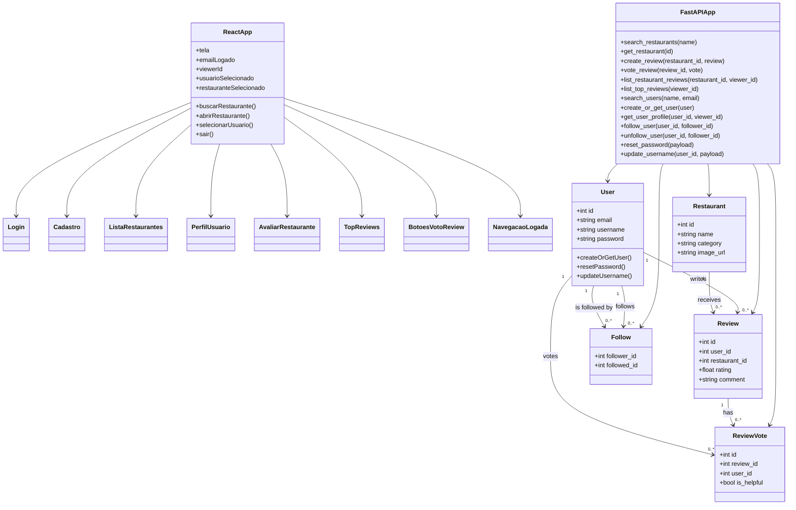
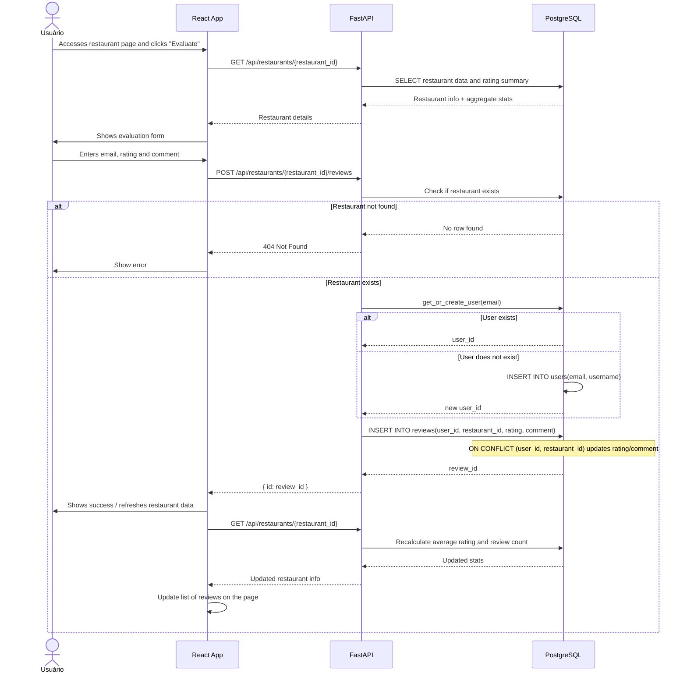

# tp-eds

## Como executar

Com o Docker Desktop instalado e em execução, inicie o banco de dados, a API e o site de uma vez:

```sh
docker compose up --build
```

Quando os serviços estiverem prontos, acesse o site em <http://localhost:5173>. A API fica disponível em <http://localhost:8000>.
Os dados de exemplo de `backend/seed.py` são inseridos automaticamente na inicialização, sem duplicação ao reiniciar.

Para encerrar os serviços, pressione `Ctrl+C`. Para também remover os containers, execute `docker compose down`.

## Membros
- Camila de Almeida Ribeiro (backend)
- Emerson Araújo Simões (full)
- Gabriel Wilson Dos Santos Da Silva (frontend)
- Pedro Lucas Garcia Calais (backend)

## Objetivo do Sistema
O sistema (restaurank) é um fórum de reviews de restaurantes. Usuários podem buscar restaurantes baseado em seu placar médio, comentar sobre os restaurantes listados, ler as reviews deixadas por outros usuários, e avaliar de reviews são úteis ou não.

## Tecnologias

### Linguagem
TypeScript
​Python

### Frameworks
React
Django
FastAPI

### Banco de Dados
PostgreSQL

### Agentes de IA
Cursor 
GitHub Copilot
Gemini Pro chat e Notebooks

## Histórias de Usuário
1. Como usuário, quero criar uma conta;
2. Como usuário, quero fazer login;
3. Como usuário, quero buscar restaurantes;
4. Como usuário, quero avaliar um restaurante;
5. Como usuário, quero visualizar a página de um restaurante;
6. Como usuário, quero avaliar reviews de outros usuários;
7. Como usuário, quero visualizar o perfil de outros usuários;
8. Como usuário, quero ver o histórico de reviews de outros usuários.


# UML Diagram

## System Overview



## Sequence Diagram: Leaving a Review


