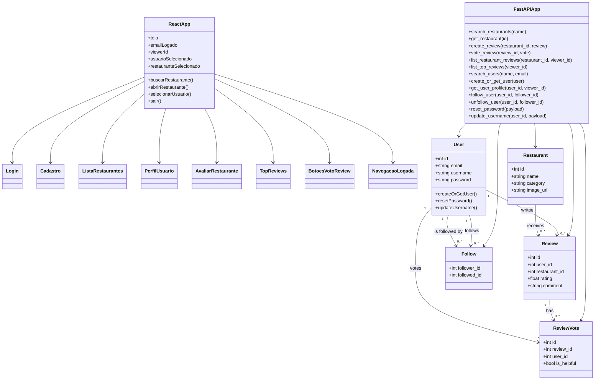
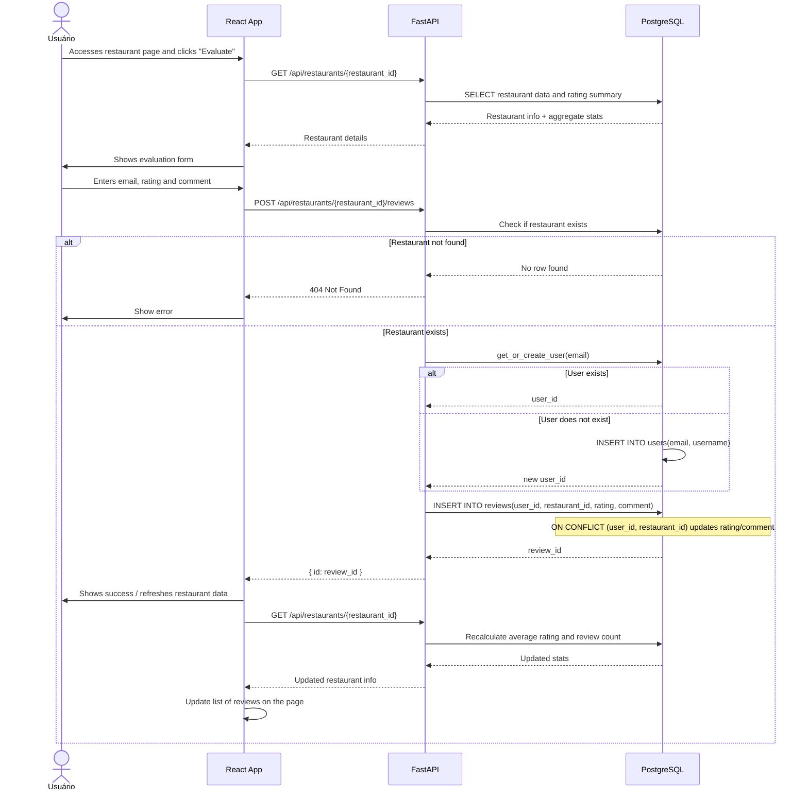

# UML Diagram

```mermaid
classDiagram
    class ReactApp {
        +tela
        +emailLogado
        +viewerId
        +usuarioSelecionado
        +restauranteSelecionado
        +buscarRestaurante()
        +abrirRestaurante()
        +selecionarUsuario()
        +sair()
    }

    class Login
    class Cadastro
    class ListaRestaurantes
    class PerfilUsuario
    class AvaliarRestaurante
    class TopReviews
    class BotoesVotoReview
    class NavegacaoLogada

    class FastAPIApp {
        +search_restaurants(name)
        +get_restaurant(id)
        +create_review(restaurant_id, review)
        +vote_review(review_id, vote)
        +list_restaurant_reviews(restaurant_id, viewer_id)
        +list_top_reviews(viewer_id)
        +search_users(name, email)
        +create_or_get_user(user)
        +get_user_profile(user_id, viewer_id)
        +follow_user(user_id, follower_id)
        +unfollow_user(user_id, follower_id)
        +reset_password(payload)
        +update_username(user_id, payload)
    }

    class User {
        +int id
        +string email
        +string username
        +string password
        +createOrGetUser()
        +resetPassword()
        +updateUsername()
    }

    class Restaurant {
        +int id
        +string name
        +string category
        +string image_url
    }

    class Review {
        +int id
        +int user_id
        +int restaurant_id
        +float rating
        +string comment
    }

    class ReviewVote {
        +int id
        +int review_id
        +int user_id
        +bool is_helpful
    }

    class Follow {
        +int follower_id
        +int followed_id
    }

    ReactApp --> Login
    ReactApp --> Cadastro
    ReactApp --> ListaRestaurantes
    ReactApp --> PerfilUsuario
    ReactApp --> AvaliarRestaurante
    ReactApp --> TopReviews
    ReactApp --> NavegacaoLogada
    ReactApp --> BotoesVotoReview

    FastAPIApp --> User
    FastAPIApp --> Restaurant
    FastAPIApp --> Review
    FastAPIApp --> ReviewVote
    FastAPIApp --> Follow

    User "1" --> "0..*" Review : writes
    Restaurant "1" --> "0..*" Review : receives
    Review "1" --> "0..*" ReviewVote : has
    User "1" --> "0..*" ReviewVote : votes
    User "1" --> "0..*" Follow : follows
    User "1" --> "0..*" Follow : is followed by
```

## Sequence Diagram: Leaving a Review

```mermaid
sequenceDiagram
    actor User as Usuário
    participant App as React App
    participant API as FastAPI
    participant DB as PostgreSQL

    User->>App: Accesses restaurant page and clicks "Evaluate"
    App->>API: GET /api/restaurants/{restaurant_id}
    API->>DB: SELECT restaurant data and rating summary
    DB-->>API: Restaurant info + aggregate stats
    API-->>App: Restaurant details
    App->>User: Shows evaluation form

    User->>App: Enters email, rating and comment
    App->>API: POST /api/restaurants/{restaurant_id}/reviews
    API->>DB: Check if restaurant exists
    alt Restaurant not found
        DB-->>API: No row found
        API-->>App: 404 Not Found
        App->>User: Show error
    else Restaurant exists
        API->>DB: get_or_create_user(email)
        alt User exists
            DB-->>API: user_id
        else User does not exist
            DB->>DB: INSERT INTO users(email, username)
            DB-->>API: new user_id
        end

        API->>DB: INSERT INTO reviews(user_id, restaurant_id, rating, comment)
        Note over DB: ON CONFLICT (user_id, restaurant_id) updates rating/comment
        DB-->>API: review_id
        API-->>App: { id: review_id }
        App->>User: Shows success / refreshes restaurant data
        App->>API: GET /api/restaurants/{restaurant_id}
        API->>DB: Recalculate average rating and review count
        DB-->>API: Updated stats
        API-->>App: Updated restaurant info
        App->>App: Update list of reviews on the page
    end
```
